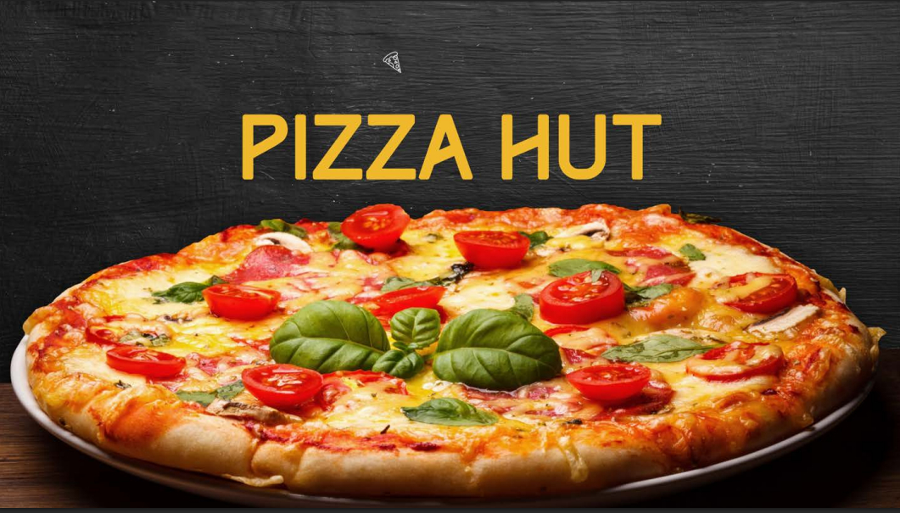

# Pizza Orders Revenue & Order Analysis

## Project Overview

This project uses MySQL to analyze pizza order data from CSV files, extracting insights on order patterns and revenue distribution to drive data-based decisions in a competitive market.

## Objectives & Key Findings

**Objectives:**
- Integrate multiple CSV data sources into a unified database.
- Analyze order trends, pricing, and revenue distribution.

**Key Findings:**
- Premium pizzas contribute significantly to revenue.
- Medium pizzas are the most popular size.
- Category-specific revenue insights inform targeted strategies.

## Project Documentation

Below is the detailed project documentation:

Click the image below to view the full project documentation:

